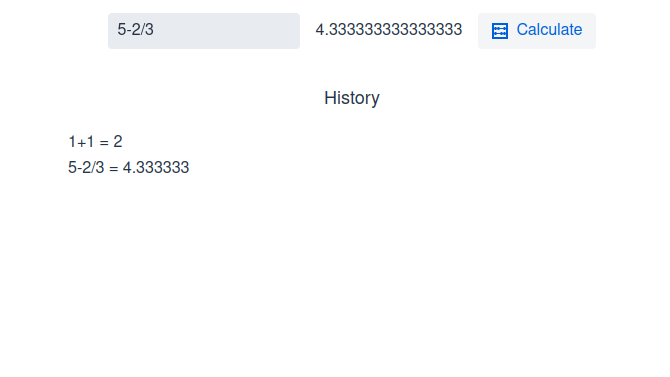

# OnlineCalc
OnlineCalc is a small 'proof of concept' web application to get a first look at the Vaadin web platform.
It's built with Spring Boot, SpringData JPA and Vaadin.

    

## Features
The webapp itself is very basic and provides an input form, a 'Calculate' button, 
as well as a history list of equations that have been calculated successfully.
Calculation and parsing of the equation is achieved by first parsing it into the reverse polish notation 
with the [shunting yard algorithm](https://en.wikipedia.org/wiki/Shunting_yard_algorithm) and then calculating 
the result from the reverse polish notation.
Errors during parsing or calculation are forwarded to the user via an Error-Notification popup.

    
    

